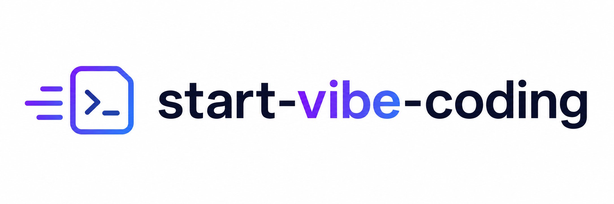

# start-vibe-coding

<p align="center">
  
</p>

Drop `INIT.md` into a fresh repo, tell your agent what you want to build, and let it start vibe coding with real project context from the first pass.

English | [简体中文](README.zh.md)

---

## Why This Exists

Starting a project with an agent usually means repeating the same setup loop:

- write the first `README`
- explain the project structure
- define coding rules
- add environment setup notes
- restate the same context every time the repo is new

`start-vibe-coding` turns that repetition into a reusable protocol. One file gives the agent enough durable context to create a clean project surface instead of waiting for more prompt-by-prompt instruction.

---

## What This Is

`start-vibe-coding` is a lightweight repository bootstrap protocol centered around `INIT.md`.

It helps an agent initialize a new repository with:

- human-facing docs
- agent-facing operating rules
- sensible repo defaults
- a minimal working structure that matches the project you described

---

## How To Use It

### 1. Drop `INIT.md` into your new repository

Copy the protocol into the root of the project you want to bootstrap.

### 2. Tell the agent what you want to build

Describe the product, tool, app, script, or library in plain language.

### 3. Ask the agent to initialize the repo from the protocol

Example prompt:

```text
I want to build a personal expense tracker web app.
Initialize this project following INIT.md.
```

From there, the agent should be able to:

- create the required files
- populate them with project-specific content
- set up the default local environment baseline
- establish a minimal working structure
- keep the human-facing and agent-facing docs consistent

---

## What `INIT.md` Creates

The protocol defines a compact starter set:

- `README.md` for the project overview and usage
- `PROJECT_LOG.md` for append-only development history
- `SPEC.md` for the project map
- `AGENTS.md` for durable coding and workflow rules
- `CLAUDE.md` as a lightweight agent entry point
- `.gitignore` for local and generated files that should stay untracked
- `requirements.txt` as the default dependency manifest
- `LICENSE` for explicit licensing from day one

By default, the protocol also expects a repository-root `.venv` so Python tooling, dependency installation, and agent instructions all point at the same local environment.

---

## Why It Works Well

This protocol creates a clean split between documents for people and documents for agents.

| Audience | Files | Job |
| --- | --- | --- |
| Humans | `README.md`, `PROJECT_LOG.md` | Explain the project, setup, usage, and progress |
| Agents | `SPEC.md`, `AGENTS.md`, `CLAUDE.md` | Define structure, rules, and execution expectations |

That separation makes collaboration smoother:

- humans get a familiar project surface
- agents get explicit operating instructions
- both stay aligned as the repo evolves

---

## Why The Agent Files Matter

Most projects already have a `README`. Fewer have durable instructions for coding agents.

`start-vibe-coding` treats agent-facing files as first-class project infrastructure:

- `AGENTS.md` holds the durable working rules
- `CLAUDE.md` stays minimal and points the agent at those rules
- `SPEC.md` keeps the repo map easy to reload

This gives the agent a stable operating context instead of relying on repeated chat prompts.

If needed, the same protocol can support multilingual docs such as `README.zh.md`.

---

## License

[MIT License](LICENSE)
